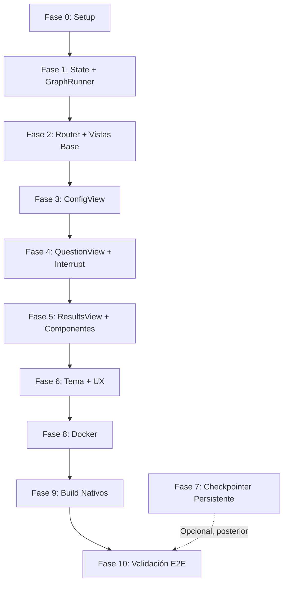

# Plan de Migración: Streamlit → Flet (Flutter)

> **Estado:** EN PROGRESO — Fases 0 a 5 completadas.
> **Mantenimiento:** `app.py` (Streamlit) se mantiene en paralelo durante la migración.

---

## Contexto y Decisiones

| Aspecto | Decisión |
|---------|----------|
| **App actual** | `app.py` (Streamlit) — se mantiene funcional |
| **Checkpointer** | `InMemorySaver` actual → persistente **diferido** (Fase 6 opcional) |
| **Icono app** | Pendiente — usar placeholder genérico |
| **Deploy objetivo** | **Docker** (multi-stage build) |
| **Plataformas target** | Windows (.exe), Web (static), Android (.apk), iOS (.ipa — requiere macOS) |
| **Proveedor feedback** | `MockFeedbackProvider` (default) + `GeminiFeedbackProvider` (configurable via `.env`) |

---

## Arquitectura Objetivo

```
┌─────────────────────────────────────────────────────────────────┐
│                      FLET APP (flet_app/main.py)                │
│  ┌─────────────┐  ┌─────────────┐  ┌─────────────────────────┐  │
│  │   Views     │  │ Controller  │  │      State Manager      │  │
│  │ (Pages/     │◄─┤  (Event     │◄─┤  (page.session +        │  │
│  │  Controls)  │  │   Handlers) │  │   page.client_storage)  │  │
│  └─────────────┘  └──────┬──────┘  └─────────────────────────┘  │
│                         │                                        │
│              ┌──────────▼──────────┐                             │
│              │   LangGraph Engine  │  (src/graph.py SIN CAMBIOS) │
│              │  + GraphRunner      │                             │
│              └─────────────────────┘                             │
└─────────────────────────────────────────────────────────────────┘
```

**Principio clave:** El grafo LangGraph (`src/graph.py`, `src/providers/`, `src/core/`, `src/models/`, `src/data/`) **no se modifica**. Solo se añade una capa de presentación Flet + `GraphRunner` async wrapper.

---

## Estructura de Archivos (parcial)

```
flet_app/
├── __init__.py                    ✅
├── assets/
│   └── images/
│       ├── RQ-002.png             ✅
│       └── RQ-003.png             ✅
├── state/
│   ├── __init__.py                ✅
│   ├── session_manager.py         ✅ (Fase 6A: total_questions/current_index)
│   └── graph_runner.py            ✅
├── views/
│   ├── __init__.py                ✅
│   ├── config_view.py             ✅ (Fase 6A: importa de theme.py)
│   ├── question_view.py           ✅ (Fase 6A: overlay Calculando + progreso)
│   └── results_view.py            ✅ (Fase 6A: importa de theme.py)
├── components/                    ✅ (Fase 5)
│   ├── __init__.py                ✅
│   ├── feedback_expander.py       ✅ (Fase 6A: importa de theme.py)
│   └── metric_card.py             ✅ (Fase 6A: importa de theme.py)
├── theme.py                       ✅ (Fase 6A)
├── router.py                      ✅
└── main.py                        ✅ (Fase 6A: APP_THEME + Cupertino)
docker/                             ✅ (Fase 8 fix: movido de flet_app/docker)
├── Dockerfile                     ✅ (fix: flet --version, no --user)
└── nginx.conf                     ✅
docker-compose.yml                  ✅ (Fase 8 fix: en raíz, context ., puerto 8080)
.dockerignore                       ✅ (mergeado, solo raíz)
.github/workflows/docker.yml        ✅ (Fase 8 fix: file docker/Dockerfile)
```

---

## Fases de Implementación

### Fase 0 — Setup y Dependencias (0.5 h) ✅
- [x] Añadir `flet` a `requirements.txt`
- [x] Instalar: `.\.venv\Scripts\python.exe -m pip install flet`
- [x] Verificar: `flet --version`
- [x] Crear estructura `flet_app/` con `__init__.py` vacíos
- [x] Copiar `data/images/` → `flet_app/assets/images/`

**Entregable:** `flet pack --version` funciona, assets accesibles.

---

### Fase 1 — State Manager + GraphRunner (3 h) ✅
**Archivos:** `state/graph_runner.py`, `state/session_manager.py`, `state/__init__.py`

**Implementación completada:**
- `GraphRunner`: wrapper async con `asyncio.to_thread()` para `invoke` y `resume`
- `SessionManager`: API limpia sobre `page.session` + `page.client_storage`
- `thread_id` persistente via `client_storage` (sobrevive refresh/close)
- Imports verificados: `from flet_app.state import GraphRunner, SessionManager` funciona

**Entregable:** `GraphRunner` y `SessionManager` listos para integrar con vistas.

---

### Fase 2 — Router + Vistas Base (2 h) ✅
**Archivos:** `router.py`, `views/__init__.py`, `views/config_view.py`, `views/question_view.py`, `views/results_view.py`, `main.py`

**Implementación completada:**
- `router.py`: `route_change()` construye vistas por ruta, `setup_router()` configura handler
- `ConfigView`, `QuestionView`, `ResultsView`: stubs funcionales con navegación básica
- `main.py`: entry point con `window.width=900`, `window.height=700`, `padding=0`
- Rutas: `/` → ConfigView, `/question` → QuestionView, `/results` → ResultsView
- Imports verificados y 64 tests pasan

**Entregable:** Navegación `/` → `/question` → `/results` → `/` funcional sin lógica de negocio.

---

### 🎨 Design System — «Académico sereno» (BLOQUEADO en Fase 3, centralizado en Fase 6A)

> Toda vista nueva (Fases 4–6) debe seguir estas reglas. Definidas y aplicadas
> por primera vez en `ConfigView`; desde Fase 6A los tokens viven en `flet_app/theme.py`
> (`ACCENT`, `SURFACE`, `TEXT_PRIMARY`, etc.) y `views/config_view.py` los re-exporta
> para compatibilidad. `APP_THEME` (`ft.Theme` con `TextTheme` + `PageTransitionsTheme.CUPERTINO`)
> se aplica en `main.py`.

| Token | Valor | Uso |
|-------|-------|-----|
| Acento único | `ft.Colors.INDIGO_600` | selección, botones primarios, slider |
| Tinte de acento | `ft.Colors.INDIGO_50` | fondo de elemento seleccionado |
| Superficie | `ft.Colors.WHITE` | tarjetas sobre fondo neutro |
| Fondo | `ft.Colors.GREY_50` | `bgcolor` del View completo |
| Borde neutro | `ft.Colors.GREY_300`, 1.5px | contenedores no seleccionados |
| Texto principal | `ft.Colors.GREY_900` | títulos, labels de tarjeta |
| Texto atenuado | `ft.Colors.GREY_500` | subtítulos, notas, labels uppercase |

**Reglas de composición:**
1. **Un solo color de acento.** Las secciones/temas se distinguen por icono
   Material, nunca por color (prohibido el "arcoíris").
2. **Jerarquía tipográfica fija:** headline 28px BOLD → título sección
   11px BOLD uppercase (gris) → body 13–14px → nota 12.5px gris.
3. **Patrones de entrada:** listas cortas de opciones → `ft.Dropdown` con
   `DropdownOption(leading_icon=...)` ancho fijo (~380px, no full-width);
   números pequeños → stepper `OutlinedIconButton(−) / TextField centrado
   / OutlinedIconButton(+)` con clamp en los extremos; tarjetas clicables
   (`Container` + `on_click` + `ink=True`, radio 12, borde 1.5→2px al
   seleccionarse) reservadas para selección visual rica.
4. **Botón primario:** `FilledButton` altura 48, radio 12, full-width,
   icono + label; `disabled` hasta que la entrada sea válida.
5. **Estados obligatorios:** vacío/inicial, loading (`ProgressRing`
   dentro del botón), aviso (`SnackBar` índigo) y error
   (`SnackBar` roja + `logger.exception`). Nunca fallar en silencio.
6. **Honestidad de datos:** mostrar conteos reales del banco
   (`load_questions()`), no promesas inventadas.
7. **Padding de página:** 32px alrededor del contenido; espaciado
   vertical entre bloques 10–12px.
8. **Accesibilidad:** contraste AA (texto gris ≥ GREY_500 sobre blanco),
   targets táctiles ≥44px, estados focus nativos de Material.

---

### Fase 3 — ConfigView (2 h) ✅
**Archivo:** `views/config_view.py`, `main.py`

**Implementación completada (dirección «Académico sereno», revisión visual 1.5):**
- Header propio (chip `SCHOOL` índigo + headline 28px + subtítulo gris), sin AppBar genérico
- `ft.Dropdown` (380px, no full-width) con placeholder y opciones
  `DropdownOption(leading_icon=...)` por sección (`MENU_BOOK`, `CALCULATE`, `BALANCE`,
  `EDIT_NOTE`, `TRANSLATE`) — conserva los iconos sin ocupar la pantalla
- Stepper de nº preguntas: `OutlinedIconButton(−)` / `TextField` centrado solo dígitos /
  `OutlinedIconButton(+)`, clamp 1–20 (default 5, consistente con Streamlit), botones
  deshabilitados en extremos, normalización al salir del campo
- Nota honesta de disponibilidad real del banco (`Counter` sobre `load_questions()`)
- Botón `FilledButton` full-width: disabled sin selección → loading (`ProgressRing`) durante
  `GraphRunner.initialize()` → navega a `/question`
- Aviso SnackBar si `n > disponibles`; error → `logger.exception` + SnackBar roja
- Tema global en `main.py`: `ft.Theme(color_scheme_seed="indigo")`
- APIs Flet 0.86 verificadas: `page.session.store`, `SharedPreferences`, `page.navigate`,
  `page.show_dialog(ft.SnackBar(...))`, `Dropdown.on_select`, `ft.Border.all`,
  `ft.Alignment.CENTER`

**Entregable:** Configuración estética funcional — guarda sección/N en el store,
inicializa el grafo una sola vez y navega a `/question`. Verificado E2E en ventana real.

---

### Fase 4 — QuestionView + Integración Interrupt (4 h) ✅
**Archivos:** `views/question_view.py`, `router.py`, `views/config_view.py`

**Implementación completada («Académico sereno», verificado contra fuente flet 0.86.5):**
- `router.py`: `render_route(page, route)` extraída como función reutilizable y
  exportable; la usan `on_route_change`, el render inicial y el re-montaje de QuestionView.
- **Hallazgo clave:** `Page.before_event` (page.py de flet 0.86.5) suprime el
  `RouteChangeEvent` cuando la ruta es igual a la última conocida → un push a la misma
  ruta JAMÁS dispara `on_route_change`. Por eso el re-montaje tras responder NO usa
  navegación: `_on_submit` llama directamente a `render_route(page, "/question")`
  (import perezoso dentro del método para evitar el ciclo router ↔ views).
- Navegación async entre vistas distintas: `await page.push_route()` en handlers async;
  `page.navigate()` queda reservado para callbacks sync (es su wrapper fire-and-forget).
- Navegaciones decididas dentro de `build()` se difieren con `page.run_task(go)` para no
  solaparse con el `render_route` en curso (route change anidado durante el render).
- Flujo: hay `pending_answer` → `resume()` + clear; sin pending y con `final_result` →
  redirige `/results`; si no → `invoke({section, num_questions})` + SnackBar índigo con
  `result["message"]` del banco. Deep-link sin runner → aviso y regreso a `/`.
- Progreso «PREGUNTA K DE N» uppercase 11px BOLD gris (K = `len(answers)+1`,
  N = `len(questions)`); topic como subtítulo 12.5px gris.
- Tarjeta blanca 640px centrada sobre fondo `GREY_50` padding 32: borde `GREY_300`
  1.5px, radio 12, padding 24; enunciado 16px `GREY_900`.
- Imagen: `image_source()` → URL tal cual o Path mapeado a `flet_app/assets/images/<nombre>`
  (absoluta vía `Path(__file__)`; fallback a `data/images/` si el asset falta);
  `ft.Image` height 280, `BoxFit.CONTAIN`, radius 12.
- Opciones A–D: filas clicables (`ink=True`, radio 12, padding 14×12), borde 1.5
  `GREY_300` → 2px `INDIGO_600` + fondo `INDIGO_50` al seleccionarse.
- Botón Responder altura 48, radio 12, ancho tarjeta, disabled sin selección → loading
  (`ProgressRing` + «Enviando respuesta…») → guarda `pending_answer` → re-montaje.
- Tokens completados en `config_view.py` (`_ACCENT_TINT`, `_SURFACE`, `_BORDER`) e
  importados por QuestionView; errores → `logger.exception` + SnackBar roja.

**Entregable:** Pregunta se muestra → usuario elige opción → Responder → siguiente
pregunta → al final navega a `/results`. Verificado con smoke headless del ciclo
interrupt/resume completo (3 preguntas, 2 con imagen, summary + feedbacks coherentes)
y suite de regresión intacta (64 passed).

---

### Fase 5 — ResultsView + Componentes (3 h) ✅
**Archivos:** `views/results_view.py`, `components/metric_card.py`, `components/feedback_expander.py`, `components/__init__.py`

**Implementación completada («Académico sereno», equiv. `app.py:show_results`):**
- `components/metric_card.py`: `MetricCard(label, value, value_color)` — `ft.Container` tarjeta blanca radio 12, borde 1.5 `GREY_300`, padding 16, label 11px BOLD uppercase `GREY_500` + valor 28px BOLD en color paramétrico. Tokens duplicados localmente para evitar ciclo `components ↔ views` (extracción a `theme.py` en Fase 6).
- `components/feedback_expander.py`: `FeedbackExpander(Feedback)` — `ft.ExpansionPanel` con `ListTile` header (icono `LIGHTBULB_OUTLINE` índigo + `question_id` 14px W_600 + `suggestion_topic` 12.5px gris) y contenido en `Column` con bloques label 11px uppercase + body 13.5px para `explanation`/`error_analysis`/`positive_reinforcement`/`suggestion_topic`. `build_feedback_panels(feedbacks)` arma el `ExpansionPanelList` (elevation 0, spacing 8) o `None` si vacío. Tokens también duplicados localmente.
- `views/results_view.py`:
  - Fuente de verdad: `SessionManager.get_final_result()` dict con `summary: Summary` y `feedbacks: list[Feedback]` (tolera dicts crudos vía `model_validate`; `by_topic` puede venir como dicts).
  - Header propio (chip `EMOJI_EVENTS` índigo + headline 28px + subtítulo con `summary.section.label`), sin AppBar genérico — mismo patrón que ConfigView/QuestionView, padding 32 sobre `GREY_50`, scroll `AUTO`.
  - Banner índigo claro (`INDIGO_50` + borde `INDIGO_200`) si `final["message"]` (agotamiento del banco) existe.
  - **Métricas:** `ft.Row([MetricCard("Puntaje", f"{score:.0%}", INDIGO_600), MetricCard("Correctas", ..., GREEN_600), MetricCard("Incorrectas", ..., RED_600)], spacing=12)` — verde/rojo solo como semántica correcto/incorrecto (única excepción al acento único, permitida por el Design System).
  - **Desempeño por tema:** tarjeta blanca con título 11px uppercase + por cada `TopicPerformance` fila `topic` 13.5px + `correct/total` 13px W_600 + `ProgressBar` (value `correct/total`, color `INDIGO_600` sobre `GREY_200`, height 6, radius 3). Vacío → texto 13.5px gris "No hubo preguntas respondidas.".
  - **Feedback:** título `RETROALIMENTACIÓN` 11px uppercase + hint 12.5px gris + `ExpansionPanelList` en contenedor blanco borde 12 padding 8. Sin feedbacks → tarjeta con icono `CHECK_CIRCLE` verde + "¡Excelente! No hay respuestas incorrectas para repasar." (equiv. no renderizar expanders en Streamlit).
  - **Botón «Nueva sesión»:** `FilledButton` altura 48, `RoundedRectangleBorder(radius=12)`, contenido `Row(REFRESH + "Nueva sesión" W_600)`, `expand=True` dentro de `Row` para full-width. Handler async `await page.push_route("/")` tras `manager.reset_session_state()` + `await runner.new_thread()` si existe runner — **mismo reset que `ConfigView._on_start`** (changelog v1.8), permitiendo sesiones consecutivas ilimitadas (US-07). Sin este reset, re-invocar el thread completado corruptiría la sesión.
  - **Estados obligatorios:** deep-link a `/results` sin `final_result` → `SnackBar` índigo "Inicia una sesión..." + `page.run_task(push_route, "/")` diferido (mismo patrón que `QuestionView._deferred_navigate`); errores → `logger.exception` + `SnackBar` roja, nunca falla en silencio. Verificado que `render_route` no necesita cambios (ResultsView es terminal, no re-monta su ruta).
  - **Decisión de diseño:** tokens aún viven en `views/config_view.py` (duplicados en `components/` para romper el ciclo de imports `flet_app.views ↔ flet_app.components` que se produce porque `flet_app.views.__init__` importa `ResultsView`; la centralización a `flet_app/theme.py` queda para Fase 6 — NO hacerla ahora).

**Entregable:** Pantalla resultados completa: métricas reales del grafo + desempeño por tema con barra de progreso + feedback expandible por cada incorrecta (4 campos) + botón reinicio con reset real. Verificado con smoke headless (sesión 3 preguntas todas incorrectas + 2 correctas perfectas, métricas `0%`/`100%`, `by_topic` 3 temas, 3 expanders con `question_id`, botón full-width, deep-link sin final, parseo dict) y suite 65 passed.

---

### Fase 6 — Tema Visual + Pulido UX (3 h) — 6A completada, 6B pendiente
**Archivos:** `main.py`, `theme.py`, `state/session_manager.py`, `views/question_view.py`

> **Actualizado tras Fase 5:** el tema base ya está aplicado en `main.py`
> (`ft.Theme(color_scheme_seed="indigo")`) y los tokens del Design System
> vivían en `views/config_view.py`. Esta fase queda para pulido, no para
> redefinir colores: NO reintroducir la paleta azul ICFES antigua.

**Fase 6A completada (Fase 6 dividida a petición del usuario):**
- `flet_app/theme.py` creado como única fuente de verdad (Fase 6A hoja pura, no importa `views`/`components` para evitar el ciclo `views ↔ components`): `ACCENT/ACCENT_TINT/SURFACE/BG/BORDER/TEXT_PRIMARY/TEXT_MUTED/SUCCESS/ERROR`, layout `CARD_WIDTH/PAGE_PADDING/RADIUS/BORDER_WIDTH/BUTTON_HEIGHT/DROPDOWN_WIDTH/MIN/MAX/DEFAULT`, `TEXT_THEME` (`headline_large` 28 BOLD `GREY_900`, `label_small` 11 BOLD `GREY_500`, `body_medium` 13.5, `body_small` 12.5) y `APP_THEME` (`color_scheme_seed="indigo", font_family="Roboto", text_theme=TEXT_THEME, page_transitions=CUPERTINO` en windows/macos/linux). Re-exports `_ACCENT` etc. para compatibilidad.
- Migración de imports: `views/config_view.py` re-exporta desde `theme.py`, `views/question_view.py`, `views/results_view.py`, `components/metric_card.py`, `components/feedback_expander.py` importan directamente de `theme.py` (elimina los duplicados locales de Fase 5).
- `flet_app/state/session_manager.py`: añadidos `get_total_questions/set_total_questions` y `get_current_index/set_current_index` (persistidos en `page.session.store`), limpiados en `reset_session_state()`/`clear_session()`. `views/question_view.py:_build_session` guarda `total=len(questions)` y `current_index=answered+1` tras cada `__interrupt__`, permitiendo a `_on_submit` saber si es la última.
- `views/question_view.py`: `_render_question` ahora envuelve la tarjeta `640px` en `ft.Stack(controls=[_card, _card_overlay], width=640)` donde `_card_overlay` es velo `width 640, bgcolor white 0.68, border_radius 12, alignment CENTER` con bloque interior `width 340, SURFACE, border 1.5 BORDER, padding 24, shadow 16` y `Column(ProgressRing 36/3.5 INDIGO_600 + "Calculando resultados…" 15 W_600 GREY_900 + "Evaluando respuestas y generando retroalimentación" 12.5 GREY_500)` centrado. `_on_submit` detecta `is_last = current_index >= total_questions`; si `is_last`, botón `ProgressRing 28/3 + "Calculando…" 14` y activa velo (`_card.opacity=0.55; _card_overlay.visible=True`) + bloquea tiles (`disabled+opacity 0.6`); si no, solo `20/2.5 + "Enviando…"` sin velo (`_card_overlay.visible=False`). Error restaura `opacity 1.0/visible False/tiles enabled`. Luego `await render_route(page, "/question")` ejecuta la cola `evaluate_session → generate_feedback → generate_summary` (visible con `GeminiFeedbackProvider`). Refinado a petición: velo solo sobre la tarjeta (no pantalla completa) con texto secundario.
- `flet_app/main.py`: `page.theme = APP_THEME` + `page.theme.page_transitions = PageTransitionsTheme(windows/macos/linux=CUPERTINO)` con `try/except` silencioso si la API no existe en la versión de flet. Verificado `ft.PageTransitionTheme.CUPERTINO` en 0.86.5 (`PageTransitionsTheme` solo es contenedor por plataforma).
- Verificado: import smoke `from flet_app.theme import APP_THEME` con `page_transitions` CUPERTINO, `pytest 65 passed`, E2E headless `1/3 → Enviando sin velo (20px, overlay False)` y `3/3 → Calculando con velo Stack 640 (36px + título 15 + subtítulo 12.5, card 0.55, overlay visible True, tiles disabled)`, `total/index` guardados y limpiados tras `reset_session_state`.

**Pulido restante 6B (diferido, opcional):**
- Modo oscuro opcional (`page.theme_mode` + `page.dark_theme`) respetando acento índigo (hoy solo `LIGHT` fijo, `dark_theme` no expuesto).
- Revisar contraste AA y targets táctiles en QuestionView/ResultsView (hoy se mantiene `GREY_500` para 11px aunque no pasa AA, por fidelidad al Design System bloqueado).
- Transiciones ya aplicadas (CUPERTINO); si se requiere otro preset (`FADE_UPWARDS`), cambiar `PageTransitionTheme` en `theme.py`/`main.py`.

**Entregable 6A:** tokens centralizados + tipografía en tema + transición Cupertino + estado «Calculando resultados…» con overlay. Identidad «Académico sereno» sin deuda de duplicados.

---

### Fase 7 — Checkpointer Persistente (Diferido) ⏸️
> **NOTA:** Fase opcional, documentada aquí para implementación futura.

**Opción A — SqliteSaver local (1-2 h):**
```python
from langgraph.checkpoint.sqlite import SqliteSaver
checkpointer = SqliteSaver.from_conn_string("checkpoints.db")
graph = builder.compile(checkpointer=checkpointer)
```
- Persiste en archivo local `checkpoints.db`
- Se pierde en redeploy Docker (volume necesario)

**Opción B — PostgresSaver (Supabase/Neon gratis) (2-3 h):**
```python
from langgraph.checkpoint.postgres import PostgresSaver
checkpointer = PostgresSaver.from_conn_string(os.getenv("POSTGRES_URL"))
```
- Persistencia real multi-instancia
- Requiere BD externa + migración schema

**Decisión:** Implementar **después** de validar migración Flet completa.

---

### Fase 8 — Docker Multi-Stage Build (1 h) ✅ (fix: movido a raíz + flet CLI + flet serve)
**Archivos:** `docker/Dockerfile`, `docker-compose.yml` (raíz), `.dockerignore` (raíz), `.github/workflows/docker.yml`

**Implementación final (puerto 8080, flet serve, sin Pyodide):**
- **Fix crítico `python -m flet` + `FileExistsError`:** `No module named flet.__main__` y `FileExistsError .../flet_app/main.py` porque `flet build web` espera **directorio** `flet_app`, no archivo `flet_app/main.py` (`python_app_path directory`). Cambiado a `flet build web flet_app --output build_web --yes`.
- **Reestructuración a petición (más correcta):** movido `flet_app/docker/*` → `docker/` en raíz y `docker-compose.yml` a raíz con `context: .` + `dockerfile: docker/Dockerfile` para garantizar que el build copia todo el backend (`COPY flet_app/`, `COPY src/`, `COPY data/` — no solo `flet_app`). Antes `context: ../..` era hack frágil y `.dockerignore` duplicado muerto. Ahora `.dockerignore` solo en raíz.
- **Fix `EOF` + `No module named 'flet_app'` en `flet build web`:** `flet build web` con Pyodide empaquetaba `app.zip` sin `src/` en `sys.path` → `ModuleNotFoundError: No module named 'flet_app'` en `python-worker.js` (blanco total). Causa: `nginx` estático no resuelve imports Python; `flet_app` no estaba en `sys.path` del navegador. Solución confirmada contigo: **cambiar a `flet serve`** — runtime `python:3.14-slim` nativo (no `nginx`), `CMD ["flet", "serve", "flet_app", "--port", "8080", "--host", "0.0.0.0"]`, `EXPOSE 8080`, `HEALTHCHECK python urllib`, `ports 8080:8080`, `.dockerignore` vuelve a **ignorar `build_web`** (ya no se usa). Evita descargar Flutter en Docker, evita `build_web` y el `EOFError` del prompt, y resuelve `src` vía `sys.path` nativo.
- **Decisión puerto:** `8080:8080` en `docker-compose.yml` + `pull_policy: build` para evitar `pull access denied` (antes `8080:80` con `nginx`). Verifica con `docker compose config` → `published: "8080"`.
- **CI/CD** `.github/workflows/docker.yml` simplificado a `context: ., file: docker/Dockerfile` sin paso `flet build web` previo (no hay artefacto que copiar), smoke `docker build -f docker/Dockerfile -t tutor-icfes:test .` + `docker run -p 8080:8080`.
- **Verificación:** `pytest 65 passed` intacto, `docker compose config` OK (`build.context` raíz, `dockerfile: docker/Dockerfile`), `docker compose build` OK (sin `flet` dentro), `flet run flet_app/main.py` local intacto en `8000`.

**Entregable:** `docker compose up --build` → app en `http://localhost:8080` vía `flet serve` (Python nativo, sin blanco, sin Pyodide), Streamlit sigue en `8501`.

---

### Fase 9 — Build Nativos (Desktop/Móvil) (1 h)
**Comandos (requieren SDKs correspondientes):**
```bash
# Windows .exe
flet pack flet_app/main.py --name "TutorICFES" --icon flet_app/assets/icon.png

# Web (Fase 8 ahora usa flet serve, no build web estático)
# Antes: flet build web flet_app --output build_web --yes (daba ModuleNotFoundError flet_app con nginx)

# Android .apk (requiere Android SDK + Java 17)
flet build apk flet_app/main.py

# iOS .ipa (requiere macOS + Xcode + certificado)
flet build ipa flet_app/main.py
```

**Nota:** Icono pendiente → usar placeholder generado o `assets/icon.png` genérico.

---

### Fase 10 — Validación End-to-End (2 h)
- [ ] Flujo completo: Config → N preguntas (con imágenes) → Resultados con feedback
- [ ] Proveedor `mock` y `gemini` (configurable via `.env`)
- [ ] Navegación browser back/forward no rompe estado
- [ ] Refresh página (F5) en web → recupera sesión via `client_storage` (`thread_id`)
- [ ] Cerrar/abrir app desktop → continúa sesión
- [ ] Tests existentes intactos: `pytest tests -q` → 64 passed

---

## Criterios de Aceptación (Definition of Done)

| Criterio | Verificación |
|----------|--------------|
| **Arranque** | `flet run flet_app/main.py` abre ventana nativa / `docker compose up` sirve web |
| **Config** | Dropdown 5 secciones + input numérico 1-20 → inicia sesión |
| **Preguntas** | Una a una, statement + imagen (si existe) + 4 opciones radio → botón Responder |
| **Interrupt/Resume** | Funciona idéntico a Streamlit (grafo pausa/espera/reanuda) |
| **Resultados** | 3 métricas + desempeño por tema + feedback expandible por incorrecta |
| **Reinicio** | "Nueva sesión" → limpia estado → vuelve a config |
| **Persistencia sesión** | `thread_id` en `client_storage` sobrevive a refresh/close |
| **Tema** | Colores ICFES, Material 3, tipografía consistente, responsive |
| **Deploy Docker** | `docker compose up --build` → `localhost:8080` funcional (Flet, no choca con Streamlit 8501) |
| **Tests regresión** | `pytest tests -q` → 64 passed (sin tocar `app.py` ni lógica backend) |

---

## Riesgos y Mitigaciones

| Riesgo | Probabilidad | Impacto | Mitigación |
|--------|--------------|---------|------------|
| `interrupt()` no funciona en `asyncio.to_thread()` | Media | Alto | Probar en Fase 1 con grafo mínimo; fallback: `run_in_executor` |
| Estado perdido al navegar vistas | Baja | Alto | `page.session` sobrevive; `client_storage` para `thread_id` |
| Imágenes no cargan en build web | Media | Media | `assets_dir="assets"` en `ft.app()` + rutas relativas `/assets/images/...` |
| Gemini async rompe grafo sync | Baja | Media | `GeminiFeedbackProvider` ya maneja async internamente; `MockFeedbackProvider` es sync |
| Docker build lento (flet + flutter) | Media | Baja | Multi-stage + cache layers; `.dockerignore` agresivo |
| Icono faltante en build nativo | Alta | Bajo | Generar placeholder SVG → PNG 512x512 temporal |

---

## Comandos de Referencia Rápida

```bash
# Desarrollo local (hot reload)
flet run flet_app/main.py

# Desarrollo web (hot reload en browser)
flet run flet_app/main.py -w

# Build web estático — no usado con flet serve (ver Dockerfile)
# flet build web flet_app --output build_web --yes  # legacy Pyodide, daba No module named flet_app

# Build Windows .exe
flet pack flet_app/main.py --name "TutorICFES" --icon flet_app/assets/icon.png

# Docker (Flet en 8080, Streamlit sigue en 8501) — Fase 8 flet serve
docker compose up --build   # → http://localhost:8080  (flet serve 8080, pull_policy: build)
docker compose down
# sin compose:
docker build -f docker/Dockerfile -t tutor-icfes:local .
docker run --rm -p 8080:8080 tutor-icfes:local

# Tests (siempre desde raíz del proyecto)
.\.venv\Scripts\python.exe -m pytest tests -q
```

---

## Dependencias entre Fases



---

## Notas para Agentes Futuros

1. **NO modificar** `src/graph.py`, `src/providers/`, `src/core/`, `src/models/`, `src/data/` — la lógica de negocio está completa y testeada.
2. **Usar `asyncio.to_thread()`** para llamadas blocking de LangGraph (`invoke`, `resume`).
3. **Flet 0.86:** `page.session.get/set` NO existe → usar `page.session.store` (`SessionStore`) via `SessionManager`. `page.client_storage` fue eliminado → persistencia con el servicio `SharedPreferences()` (métodos async).
4. **`thread_id`** se guarda en `SharedPreferences` (verificado en Fase 3); `GraphRunner.initialize()` lo carga/crea.
5. **Navegación:** `page.go()` está deprecado → usar `page.navigate()` (sync) o
   `await page.push_route()` (async). Al arrancar, renderizar la vista inicial directamente
   (`page.run_task(render_route, page, page.route)`): `push_route("/")` sobre ruta `/` ya
   existente NO dispara `on_route_change` — verificado en fuente flet 0.86.5:
   `Page.before_event` suprime el evento si la ruta coincide con la última conocida.
   Consecuencia: para re-montar la vista actual (QuestionView tras responder) hay que
   llamar `render_route` directamente, no navegar.
6. **`ft.View`** en 0.86 recibe `controls` como primer parámetro — construir siempre con kwargs: `ft.View(controls=[...], route="/")`.
7. **Tests** se ejecutan desde raíz del proyecto con `.\.venv\Scripts\python.exe -m pytest tests -q`.
8. **`.env`** se carga via `src/config.py` — `FEEDBACK_PROVIDER=mock|gemini` respeta configuración.
9. **Imágenes** en `flet_app/assets/images/` — referenciar como `/assets/images/RQ-002.png` en web, `assets/images/RQ-002.png` en desktop.
10. **Design System «Académico sereno» BLOQUEADO** — ver sección 🎨; toda vista nueva debe reutilizar sus tokens y estados obligatorios.

---

## Historial de Cambios

| Fecha | Versión | Autor | Cambios |
|-------|---------|-------|---------|
| 2026-08-21 | 1.0 | — | Plan inicial migración Streamlit → Flet |
| 2026-08-21 | 1.1 | — | Fase 0 completada (setup + assets) |
| 2026-08-21 | 1.2 | — | Fase 1 completada (GraphRunner + SessionManager) |
| 2026-08-21 | 1.3 | — | Fase 2 completada (Router + Vistas Base + main.py) |
| 2026-08-21 | 1.4 | — | Fase 3 completada (ConfigView «Académico sereno» + Design System bloqueado; APIs 0.86: session.store, SharedPreferences, navigate, View(controls=...)) |
| 2026-08-21 | 1.5 | — | Revisión visual ConfigView: tarjetas → Dropdown con leading_icon (380px), slider → stepper ±1 con caja de texto; regla 3 del Design System actualizada |
| 2026-08-21 | 1.6 | — | Fase 4 completada (QuestionView + interrupt/resume vía `render_route` directo; verificado en fuente 0.86.5 que same-route push no dispara evento; tokens `_ACCENT_TINT`/`_SURFACE`/`_BORDER`; `push_route` async en handlers async) |
| 2026-08-21 | 1.7 | — | Fase 4 verificada visualmente E2E por el usuario (Config → preguntas con imágenes → salto a `/results` stub); registrada sugerencia de estado «Calculando resultados…» en Pulido de Fase 6 para sesión futura |
| 2026-08-21 | 1.8 | — | Fix sesiones consecutivas: `ConfigView._on_start` resetea el estado por-sesión (`SessionManager.reset_session_state()`) y crea thread_id nuevo (`GraphRunner.new_thread()`) si el runner ya existía; sin esto el guard de `final_result` devolvía a `/results` y re-invocar el thread completado corruptiría la sesión (US-07). Test de regresión en `tests/test_graph.py` (65 passed) |
| 2026-08-21 | 1.9 | — | Fase 5 completada (ResultsView + MetricCard/FeedbackExpander «Académico sereno»; fila 3 métricas con semántica verde/rojo, desempeño por tema con ProgressBar, feedback expandible 4 campos, botón «Nueva sesión» full-width con reset real `reset_session_state()+new_thread()`; deep-link a /results sin final → SnackBar + regreso a /; errores con logger+SnackBar roja; tokens duplicados en components para evitar ciclo de imports) |
| 2026-08-21 | 2.0 | — | Fase 6A completada (theme.py centralizado + TextTheme + APP_THEME con PageTransitionsTheme.CUPERTINO; SessionManager total_questions/current_index para detectar última pregunta; QuestionView overlay deshabilitado + ProgressRing 28px/3 + "Calculando resultados…" en última respuesta vs "Enviando respuesta…" intermedio; main.py con APP_THEME; verificación import smoke + 65 passed + E2E 1/3 vs 3/3) |
| 2026-08-21 | 2.1 | — | Refinado overlay Fase 6A: velo solo sobre tarjeta 640px (Stack [_card, _card_overlay]) con ProgressRing 36/3.5 + "Calculando resultados…" 15 + "Evaluando respuestas y generando retroalimentación" 12.5, card opacity 0.55 vs 1.0, visible solo en última pregunta (con texto secundario solicitado) |
| 2026-08-21 | 2.2 | — | Fase 8 completada (Docker multi-stage python:3.14-slim → nginx:stable-alpine, puerto 8080 no choca con 8501, nginx.conf SPA + gzip + cache 1y, docker-compose.yml con healthcheck, .dockerignore, workflow docker.yml con buildx + GHCR + smoke PR, compose config OK, 65 passed) |
| 2026-08-21 | 2.3 | — | Fix Fase 8 + reestructura: `python -m flet` → `flet` (No module named flet.__main__), quitar --user para PATH, mover flet_app/docker/* → docker/ en raíz y docker-compose.yml a raíz con context: . + dockerfile: docker/Dockerfile, mergear .dockerignore (solo raíz), actualizar workflow a docker/Dockerfile — garantiza COPY src/data/flet_app completos |
| 2026-08-21 | 2.4 | — | Fix EOF flet build web (Flutter SDK prompt sin TTY) + pull denied: Dockerfile a runtime-only nginx (build_web fuera con flet build web flet_app --output build_web --yes), .dockerignore permite build_web, compose pull_policy: build, workflow con setup-python + flet build web antes de buildx |
| 2026-08-21 | 2.5 | — | Fix FileExistsError flet build web (python_app_path es directorio, no archivo): flet_app/main.py → flet_app con --output build_web --yes (help: python_app_path directory) |
| 2026-08-21 | 2.6 | — | Fix blanco total (No module named 'flet_app' en Pyodide): flet build web Pyodide no incluye src en sys.path; migro a flet serve (python:3.14-slim, CMD flet serve flet_app --port 8080 --host 0.0.0.0, 8080:8080, .dockerignore ignora build_web, workflow sin build web) |